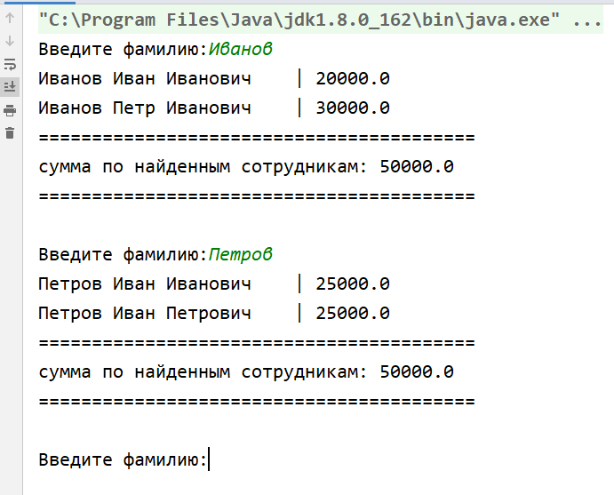

# Read employees from file

##### Описание
Пример загрузки данных сотрудников из файла в коллекцию и 
поиск по коллекции сотрудников по фамилии задаваемой в консоли.

Подсчет данных по отобранным сотрудникам, и вывод результата в консоль.

##### Формат входных данных
    Иванов Иван Иванович,1970,20000
    Иванов Петр Иванович,1969,30000
    Петров Иван Иванович,1972,25000
    Петров Иван Петрович,1980,25000

##### Результат работы

